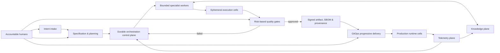

# Technical Architecture

## Component design

| Plane | Components | Responsibility |
| --- | --- | --- |
| Intent | Intake API, PRD parser, design/ticket connectors | Normalizes requests into a validated change contract. |
| Product intelligence | Retriever, code/service graph, ADR and threat-model workers | Produces grounded plan and risk record. |
| Control | Temporal, supervisor, PostgreSQL, Kafka, OPA, approvals service | Schedules work and enforces authority boundaries. |
| Worker | Specialist agents, model gateway, prompt/version registry | Performs bounded task work and emits schema-valid output. |
| Execution | MicroVM/container sandbox, preview environment, scoped identity | Runs untrusted changes and tests safely. |
| Quality | CI, tests, scanners, independent reviewer | Produces policy-checkable evidence. |
| Supply chain | Registry, Sigstore/Cosign, SBOM/provenance services | Establishes trustworthy artifact identity. |
| Delivery | Git repository, Argo CD, rollout controller, flags | Promotes immutable desired state progressively. |
| Runtime | Kubernetes regional cells, service mesh, databases | Serves production workloads with tenant and region isolation. |
| Telemetry | OpenTelemetry Collector, metrics/logs/traces backend | Feeds operations, evidence, and validated learning. |

## Core workflow states

`INTAKE → SPECIFIED → PLANNED → APPROVED_FOR_BUILD → IMPLEMENTING → VERIFYING → RELEASE_CANDIDATE → STAGING → PROMOTING → DEPLOYED`

Failure states are `NEEDS_CLARIFICATION`, `POLICY_DENIED`, `QUALITY_FAILED`, and `ROLLED_BACK`. No state transition can skip its required evidence and policy decision.

## Trust boundaries

1. The worker sandbox is untrusted: it can create candidate code and evidence, but cannot publish releases.
2. CI is trusted only to attest its isolated build result; admission verifies, rather than trusts, that attestation.
3. The release worker may promote only an already signed artifact through GitOps after OPA allows it.
4. Production identity and secrets are unavailable to development and test trust domains.
5. Knowledge retrieval is read-only by default; promotion to reusable knowledge requires validation.
